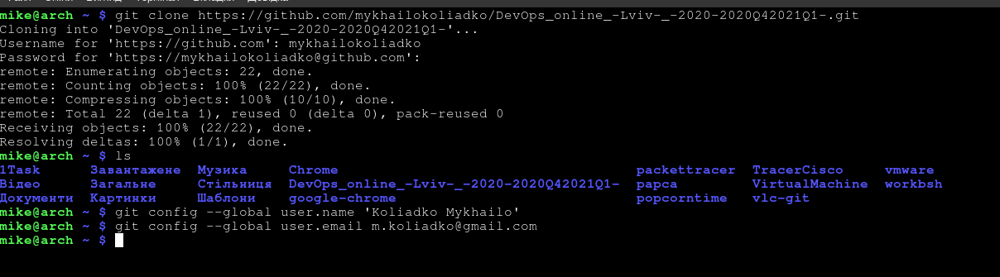
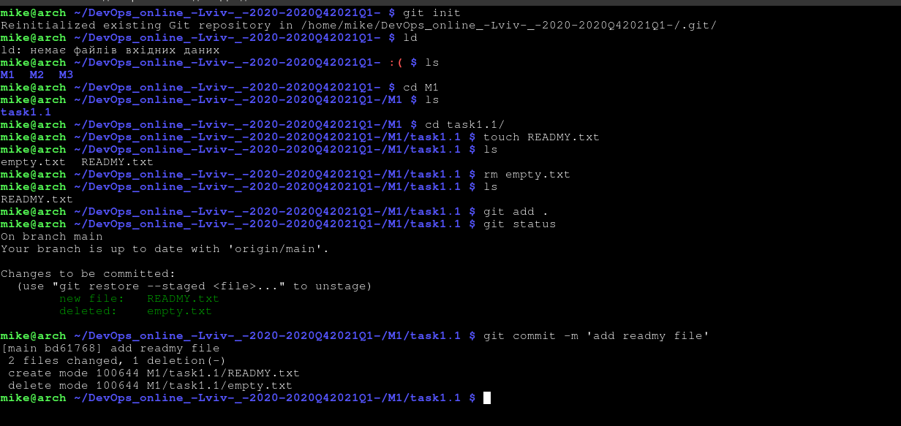
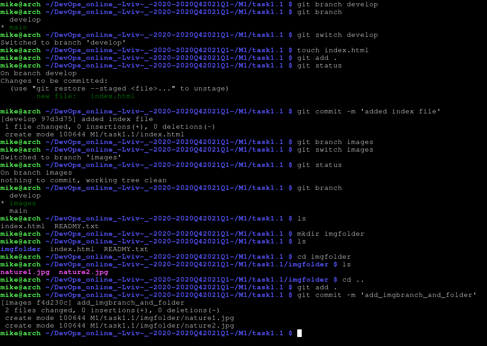
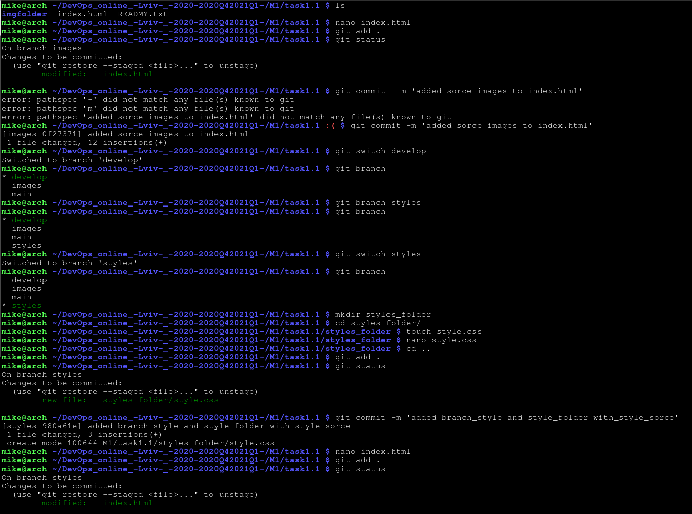
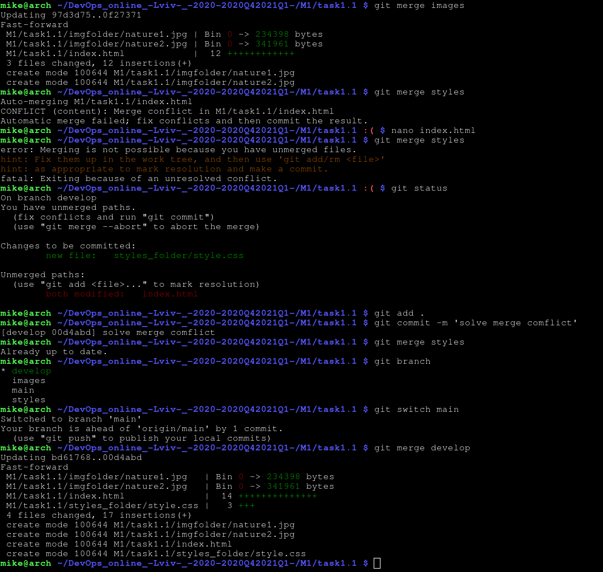
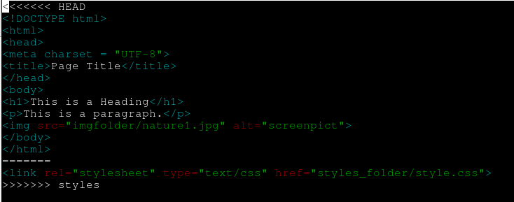
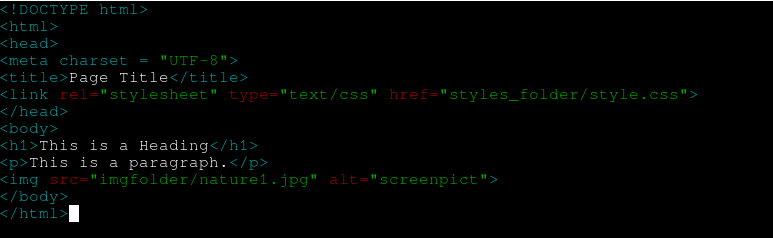
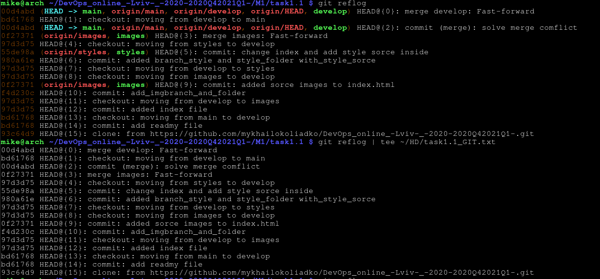

Steps from 1 to 7 installing Git, change your global configs, create new private repo,create file structure,cloning.

Steps from 7 to 10 (create emty file and make commit)

Steps from 11 to 13 (create develop branch, create index.html fil, create branch with name images)

Steps from 14 to 17 
- Change your index.html. Add images source inside it.
- Go back to develop branch.
- Create branch with name “styles”. Checkout on it. Add styles folder with
    styles source inside it. Commit.
-Change your index.html. Commit.

Steps from 18 to 21 
- Go to develop branch.
- Merge two new branches into develop using git merge command. Resolve
  conflict if it appear. Do it in next sequence:
  •merge “images” into “develop”
  •merge “styles” into “develop”
- Merge develop into master.

Merge conflict.

Solve merge conflict, just change html file and save it.

Step 24 Reflog result

Step 25 add trainers ass collsborators

Devops is a methodology or culture.
Which helps the product to grow and develop continuously, removing obstacles that arise in its path
