Most popular hypervisors
- Hyper-v
- VMware
- VirtualBox
- vSphere
- Scale Computing HC3

1.(1.1 - 1.4) Installing VirtualBox and Virtual Machine (Ubuntu 20.04)
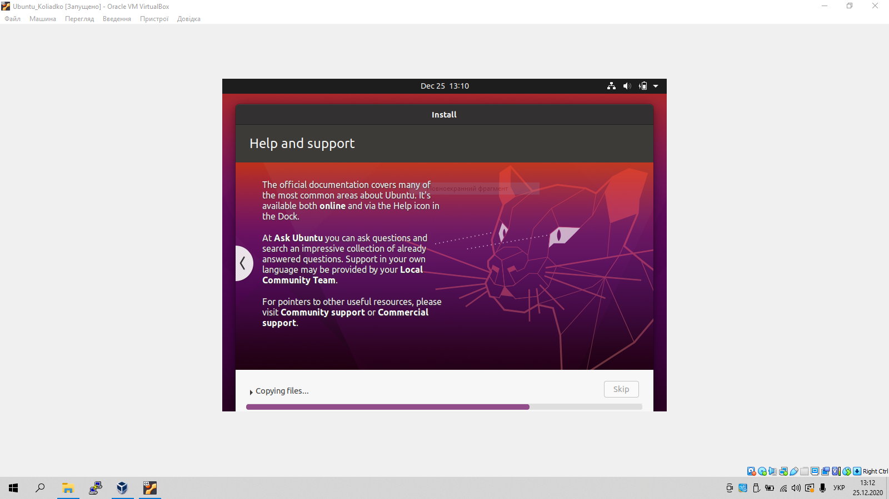
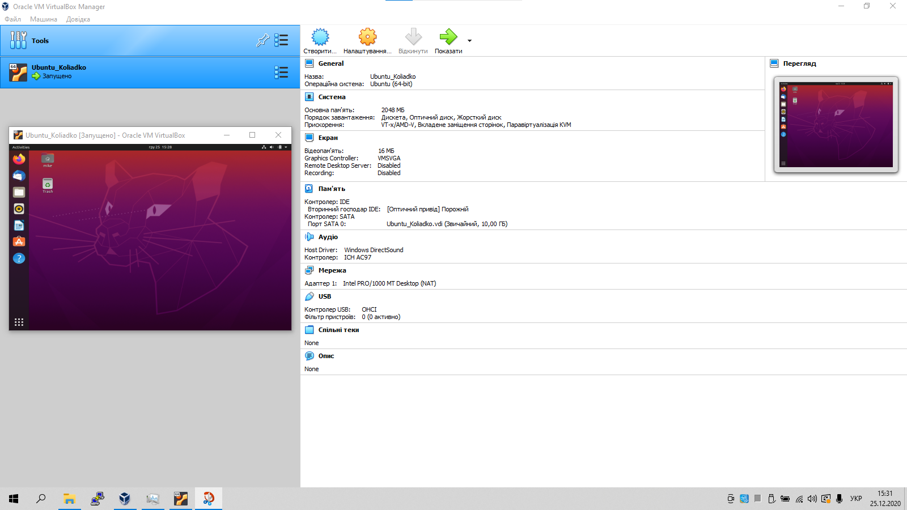

1.(1.5 - 1.7) Clone VM1
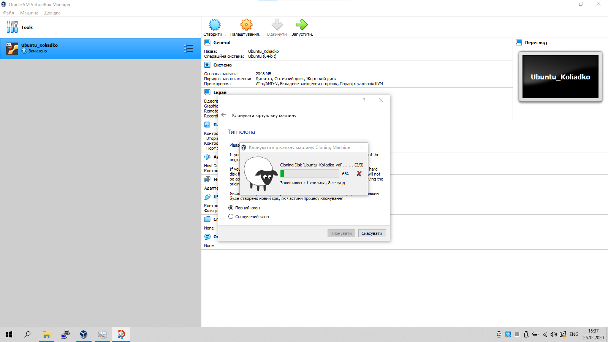
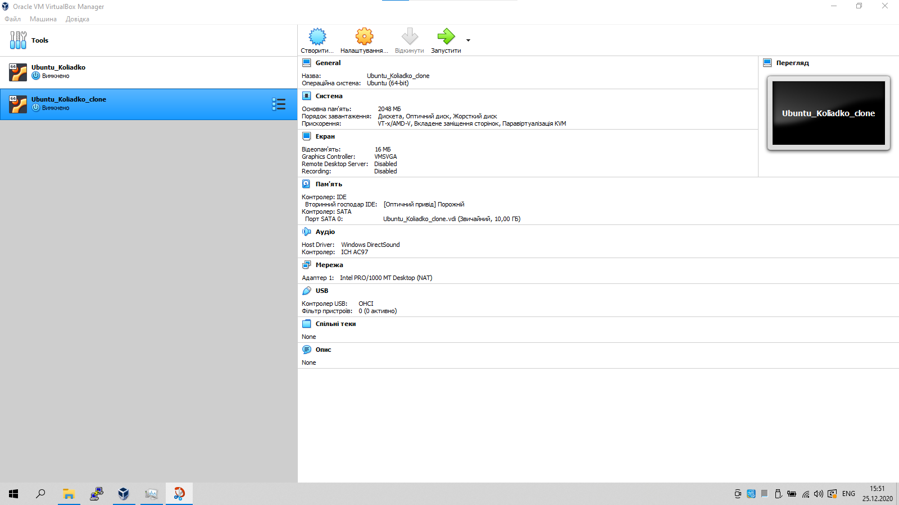

1.(1.7) Here snapshots and created group

1.(1.8) Exporting Vm
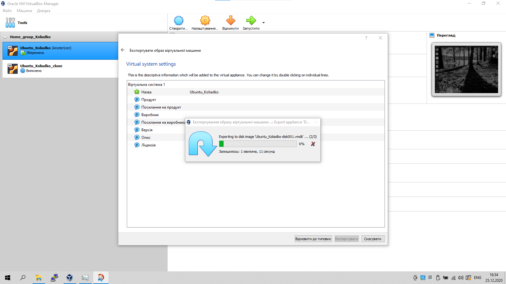

2.(2.2) Configuration of virtual machines
Configure the USB to connect the USB ports of the host machine to the VM
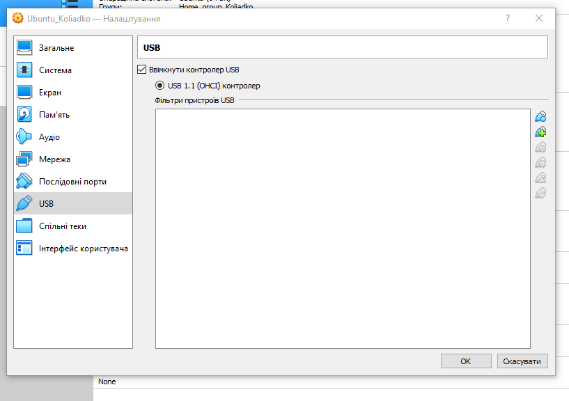
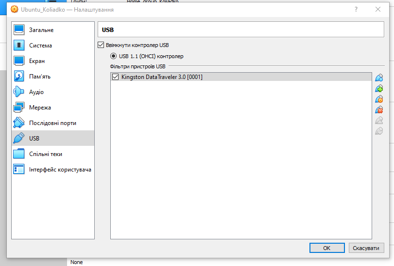

2.(2.3) Configure a shared folder to exchange data between the virtual machine and
the host
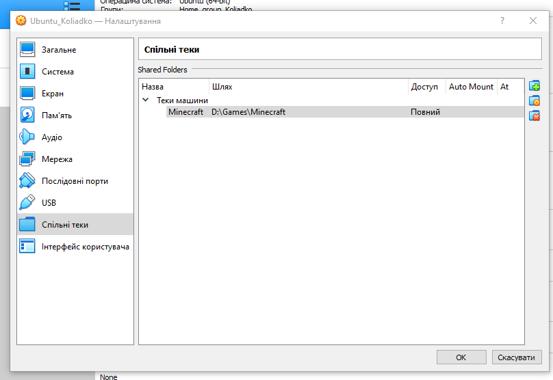

2.(2.4) Try different networks mode, here example of host-only Adapter

3.(3.1) Work with CLI through VBoxManage.
  Run the cmd.exe command line.
  Examine the purpose and execute the basic commands of VBoxManage
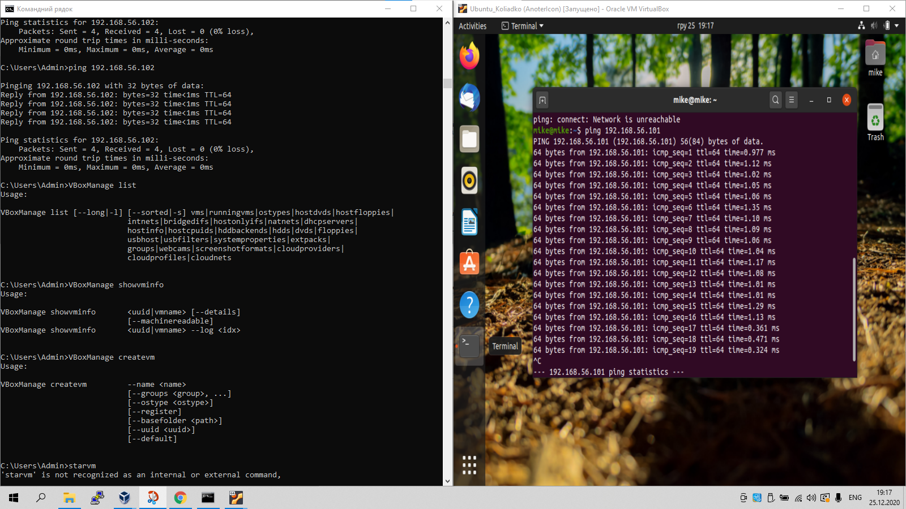

WORK WITH VAGRANT
Connect to created vagrant(Putty)
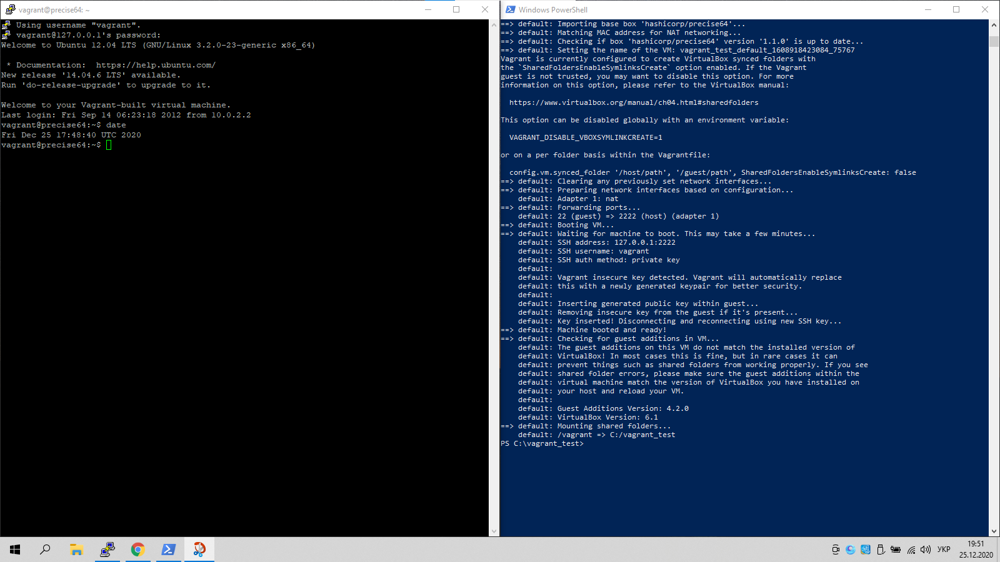
Stop And delete 
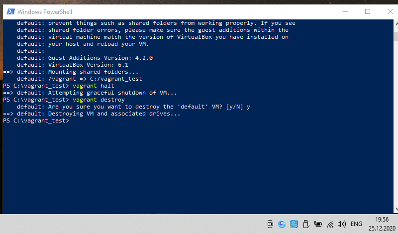

Create own vagrant (create new box, date)
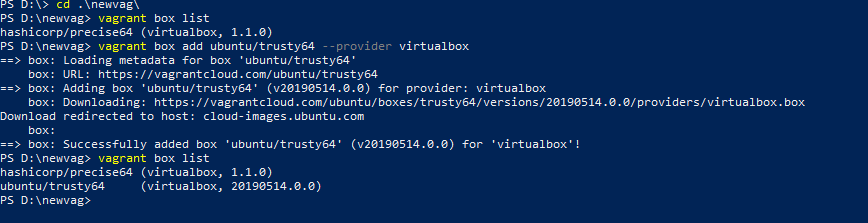
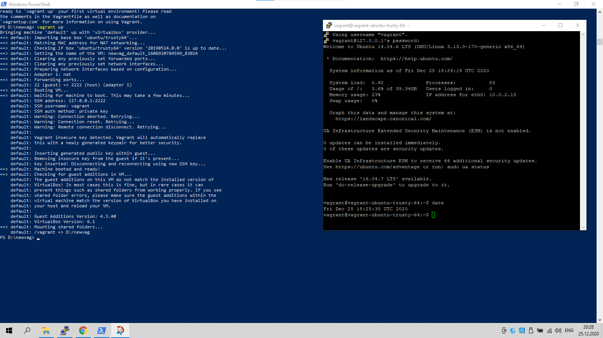

