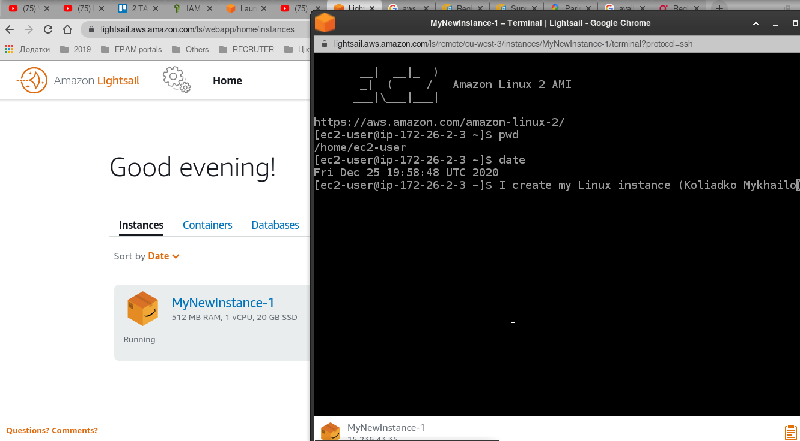
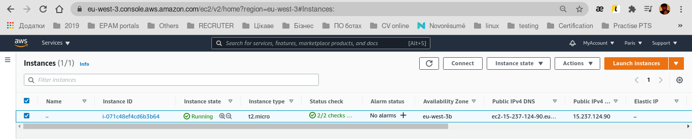
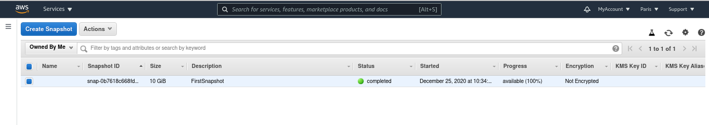
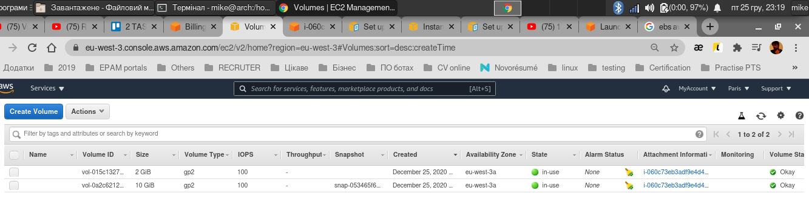
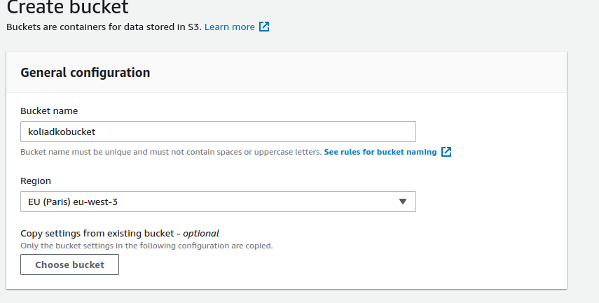
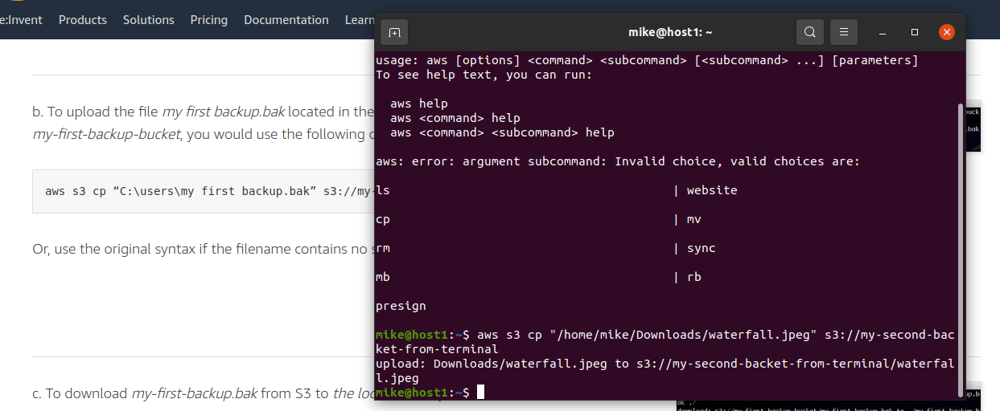
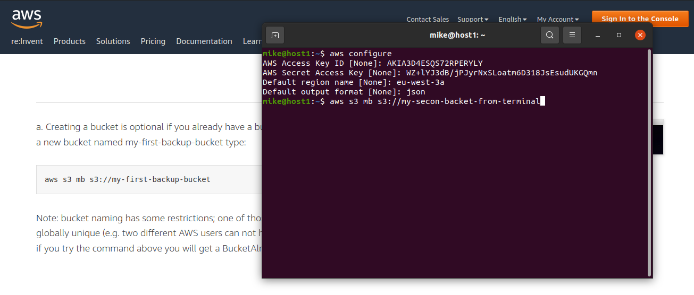

Steps 1....3 (read thr terms, register on AWS, find tutorials)

- Review the 10-minute example Launch a Linux Virtual Machine with Amazon Lightsail.
Repeat, create your own VM in the AWS cloud and connect to it.

- Launch another Linux Virtual Machine without Amazon Lightsail. It is recommended
to use the t2 or t3.micro instance and the CentOS operating system.

- Create a snapshot of your instance to keep as a backup.

- Create and attach a Disk_D (EBS) to your instance to add more storage space. Create
and save some file on Disk_D.

- Launch the third instance from backup.

- Launch and configure a WordPress instance with Amazon Lightsail link

- Review the 10-minute example Store and Retrieve a File. Repeat, creating your own
repository.
S3 

- Upload file to S3

- BucketCLI

- Create a static website on Amazon S3, publicly available
Here the link
http://mkbucker.com.s3-website.eu-central-1.amazonaws.com
