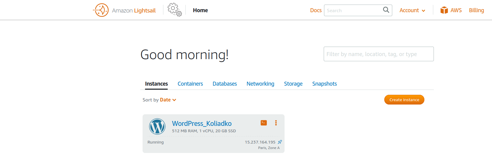

Steps 1....3 (read thr terms, register on AWS, find tutorials)

- Review the 10-minute example Launch a Linux Virtual Machine with Amazon Lightsail.
Repeat, create own VM in the AWS cloud and connect to it.

- Launch another Linux Virtual Machine without Amazon Lightsail. 

- Create a snapshot of own instance to keep as a backup.

- Create and attach new disk (EBS) to your instance to add more storage space. Create
and save some file on this disk.

- Launch the third instance from backup.

- Launch and configure a WordPress instance with Amazon Lightsail 

- Review the 10-minute example Store and Retrieve a File. Repeat, creating your own
repository. 

- Upload file to S3

- BucketCLI

- Create a static website on Amazon S3, publicly available
Here the link to my website
http://mkbucker.com.s3-website.eu-central-1.amazonaws.com
