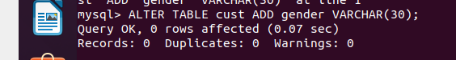

<h3>Part 1</h3>
Installing MysSQL

Create databases, tables and fill it

Construct and execute SELECT operator with WHERE, GROUP BY and ORDER BY (DDL/DML/DCL)

Create new user with all grants

New user add new filed to table

<h3>Part 2</h3>

Make backup (create dump), delete table cust and restore all.

Transfer database to RDS

<h3>Part 3</h3>

Created Amazon DynamoDB

Fill ADDB 

And Query to ADDB

