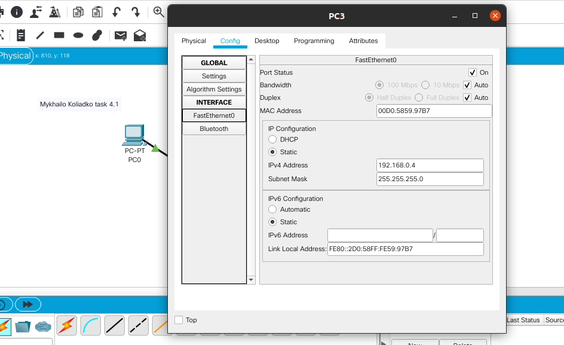
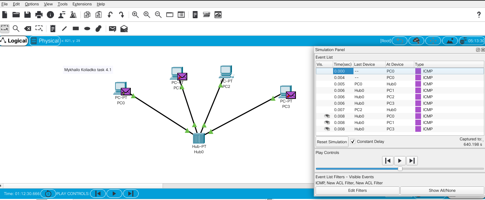
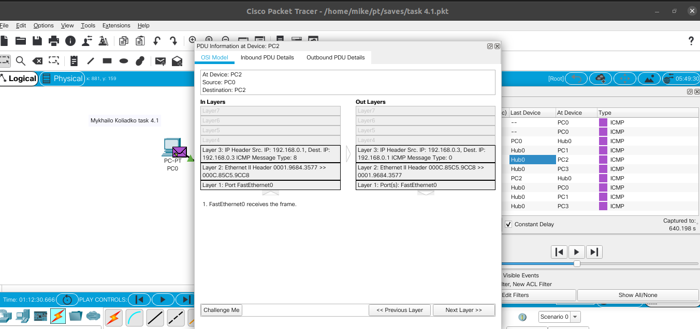
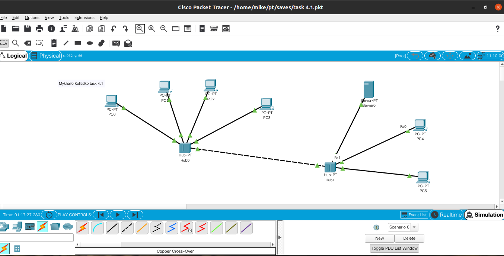
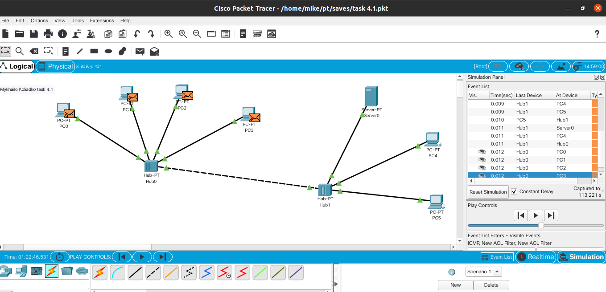
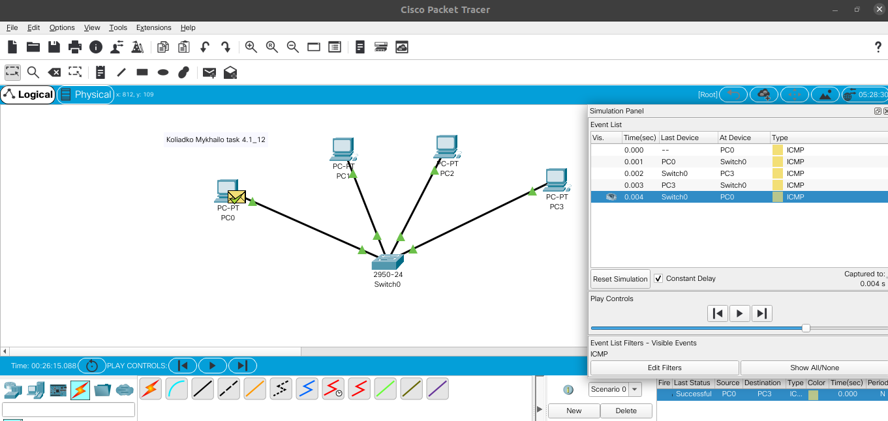
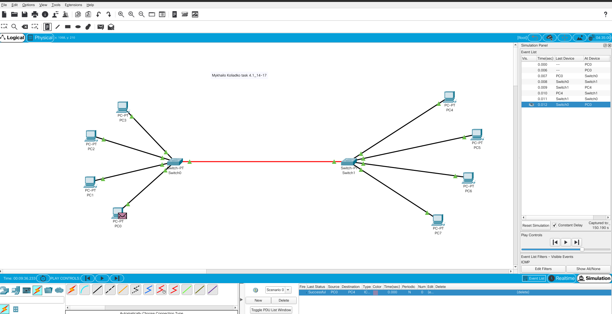
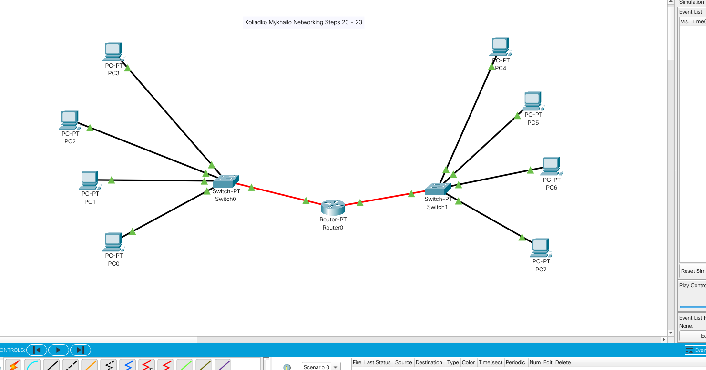
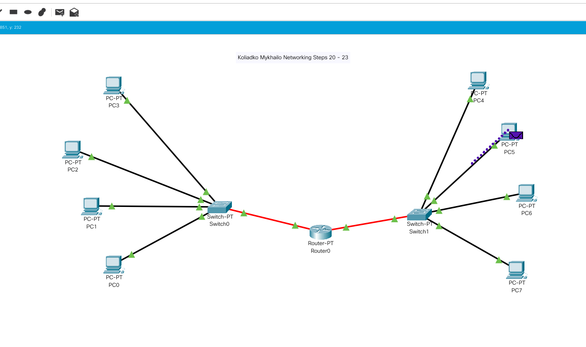
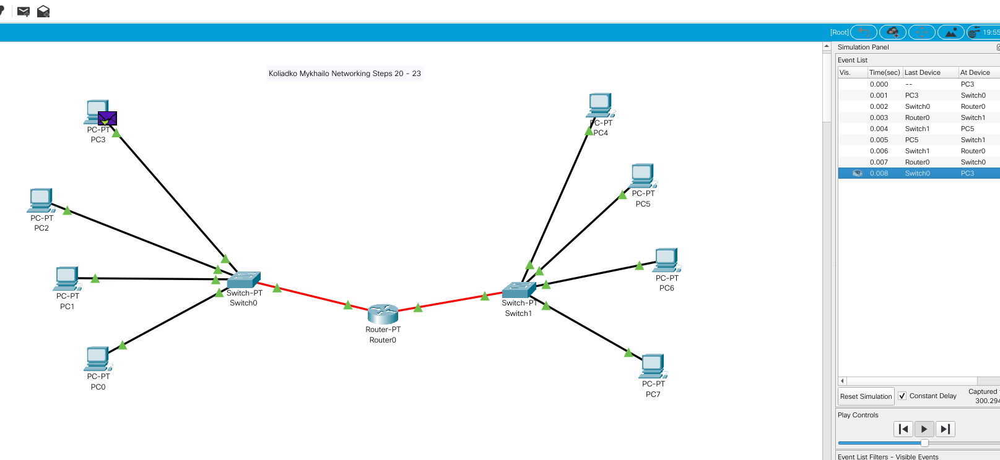

 <h3>Creating project and saving</h3>
 

h3>Assign IP for all PC`s</h3>
 

<h3>Check network with ICMP and check information about packeges</h3>
 
 

<h3>Create next progect with two hubs, assign new IP`s, and check how network works</h3>
 
 

<h3>Create new progect with switch and extended it</h3>
 

 
<h3>Divided the network, turn On router ports, mark default gateway</h3>
 

<h3>Check with ICMP</h3>

 

