<h1>Create network with two building and two floor</h1>
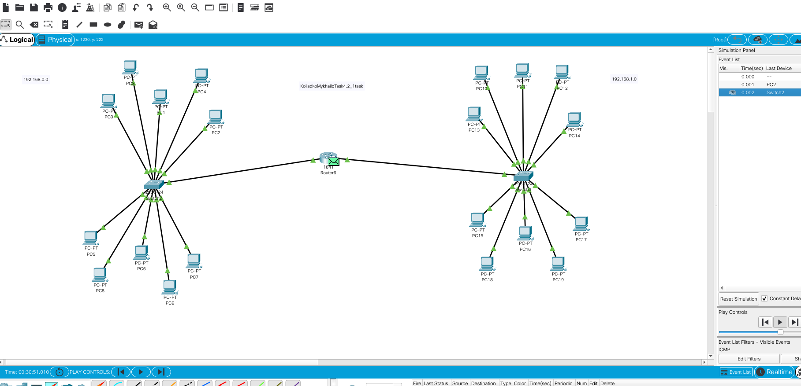
<h3>Test</h3>
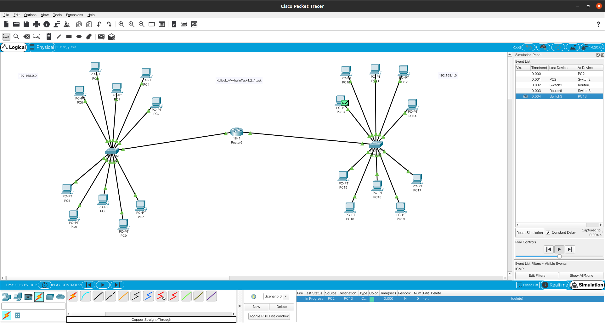
<h3>Test</h3>
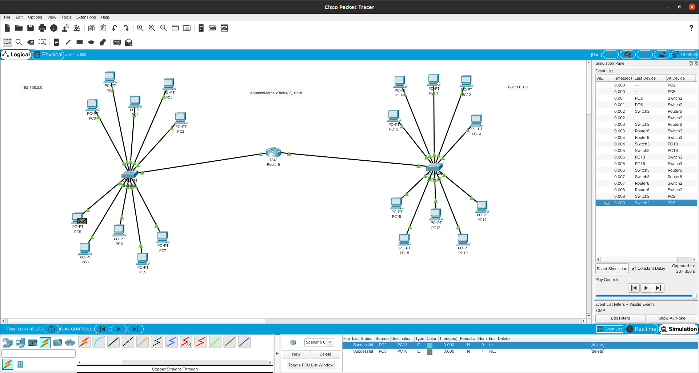
<h3>Test</h3>
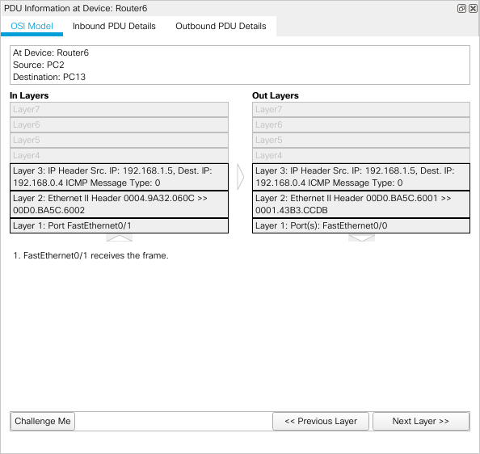
<h3>Test</h3>
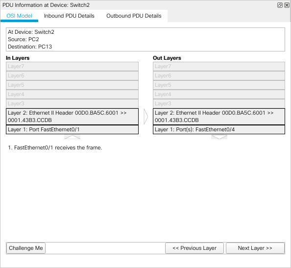

<h1>Create second network with one building and four floors</h1>
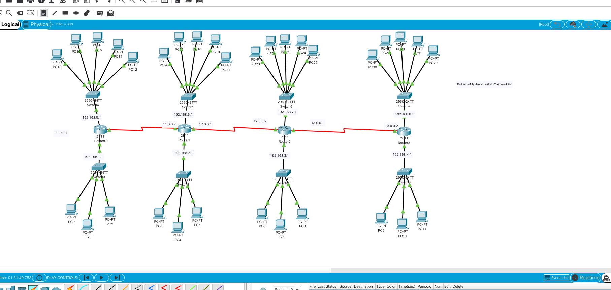

<h3>Configure router</h3>
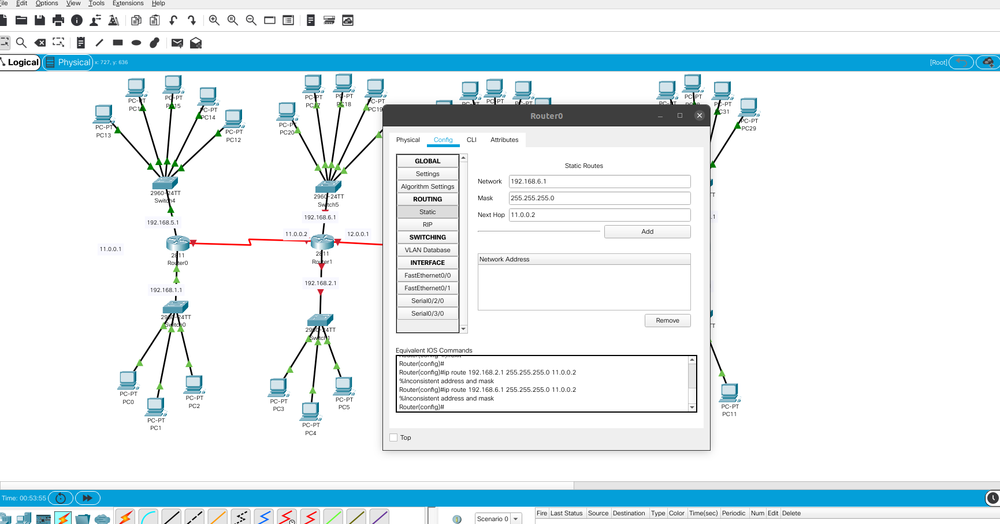

<h3>Configure second router</h3>
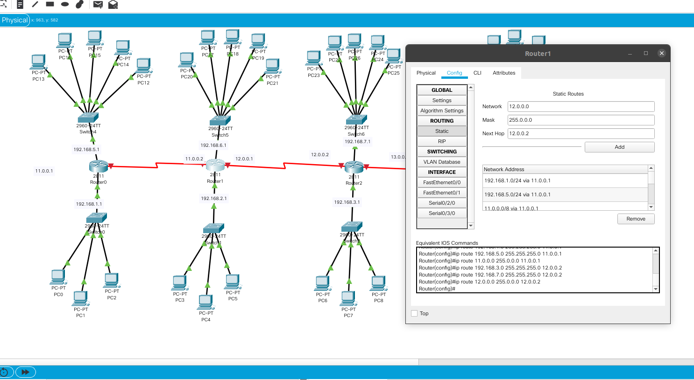

<h3>Test</h3>
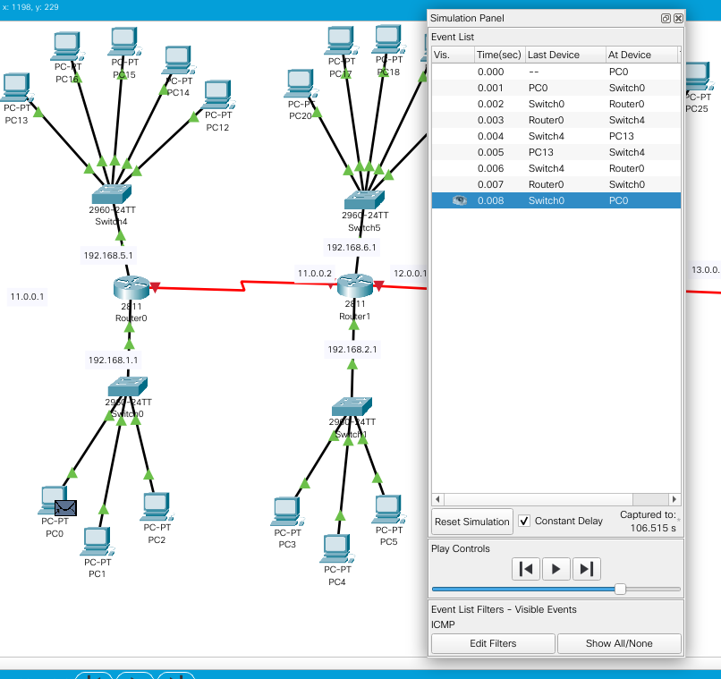

<h3>Test</h3>
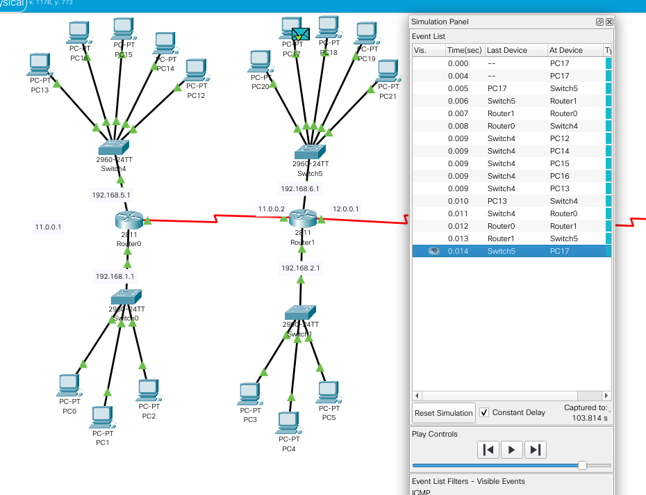
<h3>Test</h3>
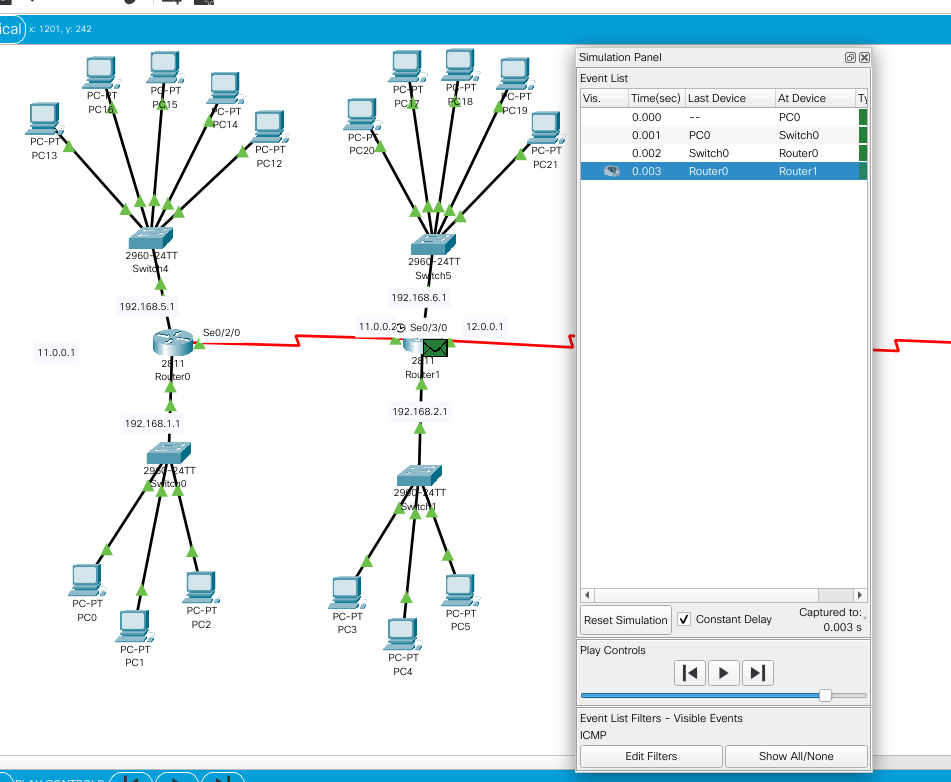
<h3>Test</h3>
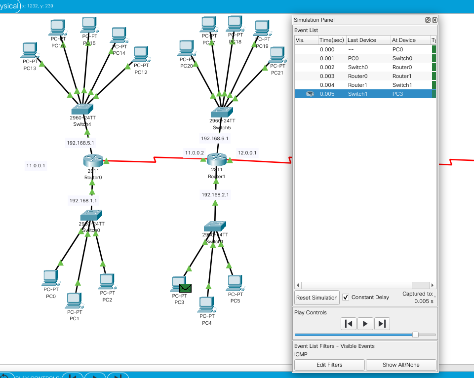
<h3>Test</h3>
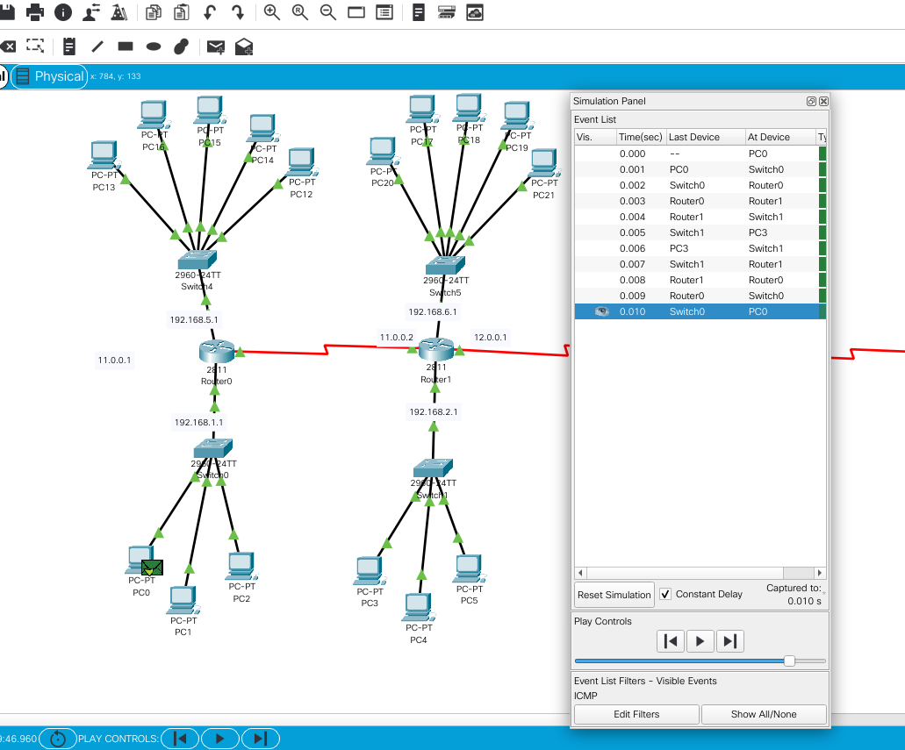
<h3>Test</h3>
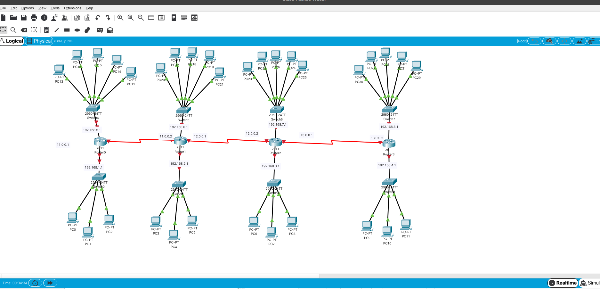

<h1>Third Network</h1>
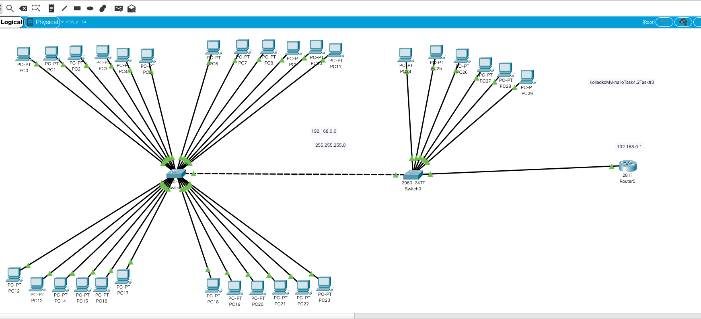

<h3>Test</h3>

<h3>Test</h3>
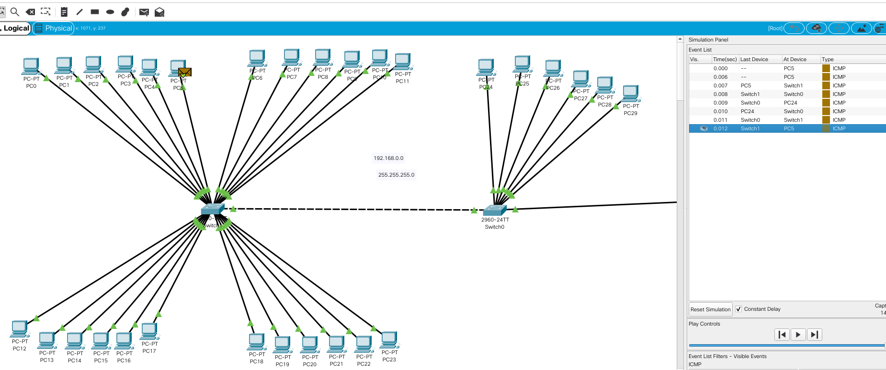

<h3>Test</h3>
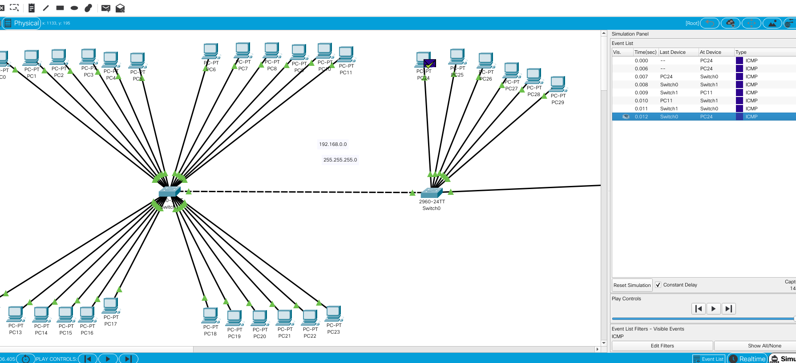

<h3>Test</h3>
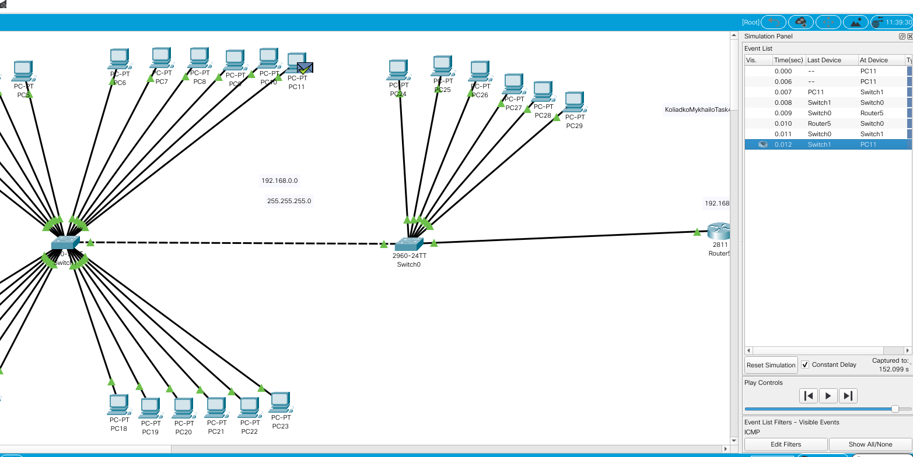

