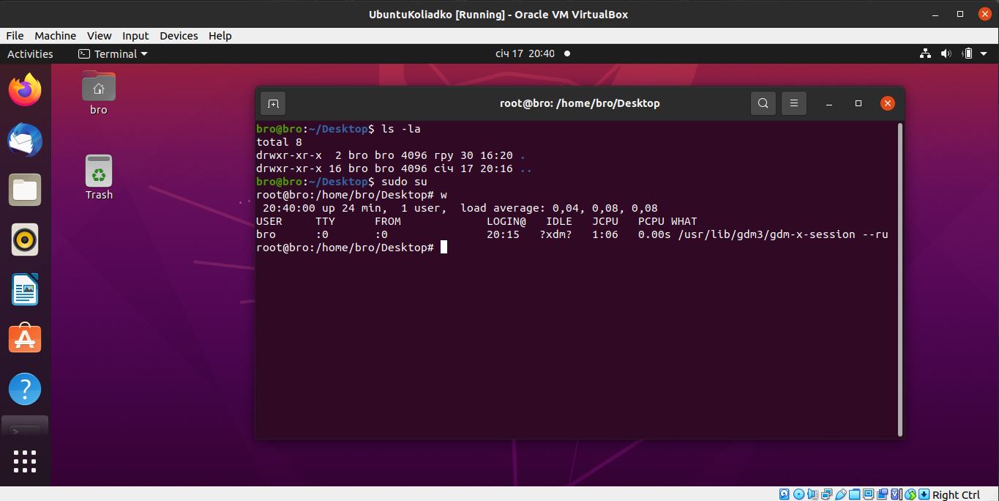
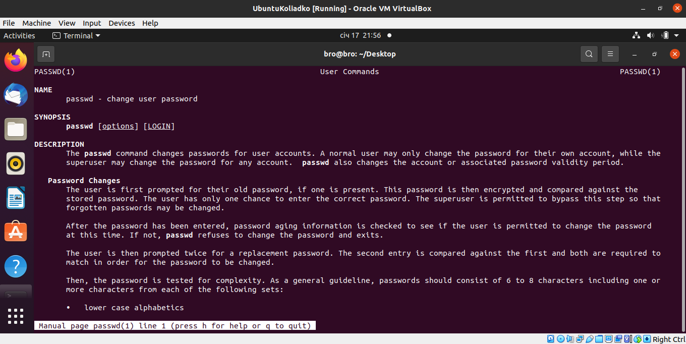

<h2>login as root</h2>

<h2>Change password</h2>

Files that also changing
<code>/etc/passwd
/etc/shadow
/etc/pam.d/passwd</code>

-----------------------------------------
<h2>What users registered in system</h2>

<h3>also can use <code>id</code> command to display more info about user</h3>

-------------------------------------------------------

<h2>Change personal information about yourself</h2>

------------------------------------------

<h2>info, man, help commands example</h2>

------------------------------------------
<h2>man,less commands example</h2>

--------------------------------------------------

<h2>List of home directory</h2>

---------------------------------------------
<h1>Part 2</h1>

<h2>Tree command</h2>

<h2>Type of file</h2>

<h2>Type of file</h2>

<h2>Navigate in file system</h2>

<h2>ls command</h2>

<h2>Perform the following sequence of operations</h2>
- create a subdirectory in the home directory;
- in this subdirectory create a file containing information about directories
located in the root directory (using I/O redirection operations);
- view the created file;

- delete the previously created subdirectory with the file requesting removal;
- delete the file copied to the home directory.

<h2>Perform the following sequence of operations, creating hard and softlinks</h2>
- create a subdirectory test in the home directory;- copy the .bash_history file to this directory while changing its name to
labwork2;
- create a hard and soft link to the labwork2 file in the test subdirectory;
- how to define soft and hard link, what do these
concepts;
- change the data by opening a symbolic link. What changes will happen and
why
- rename the hard link file to hard_lnk_labwork2;
- rename the soft link file to symb_lnk_labwork2 file;
- then delete the labwork2. What changes have occurred and why?

<h2>Determine which partitions are mounted in the system, as well as the types of these partitions</h2>

<h2>Determine which partitions are mounted in the system, as well as the types of these partitions</h2>

<h2>Using the find command, find all files in the /etc directory containing the host character sequence</h2>

<h2>Using the find command, find all files in the /etc directory containing the host character sequence</h2>

<h2>Organize a screen-by-screen print of the contents of the /etc directory</h2>

<h2>What are the types of devices and how to determine the type of device</h2>
<h4>Example of devices</h4>

<code>$ ls -l /dev</code>

<code> brw-rw----   1 root disk      8,   0 Dec 20 20:13 sda 
crw-rw-rw-   1 root root      1,   3 Dec 20 20:13 null 
srw-rw-rw-   1 root root           0 Dec 20 20:13 log 
prw-r--r--   1 root root           0 Dec 20 20:13 fdata </code>

c - character,
b - block,
p - pipe,
s - socket

<h3>Info about devices</h3>

lsusb, 
lspci, 
lsscsi

<h2>Type of file system</h2> 

ext2,
ext3,
ext4,
jfs,
ReiserFS,
XFS,
Btrfs,

<h3>How determine file system</h3> 

- lsblk -f
- df -Th

<h2>List the first 5 directory files that were recently accessed in the /etc directory</h2>
<code> ls -lth | grep ^d| head -n 5</code>

