1 --------------------Fields in passwd--------------------
- cat /etc/passwd - to check list of all users account
- cut -d: -f1 /etc/passwd - to see only names of users
- getent passwd or getent passwd user - info about all users or about particular user

Fields (from left to right)
- username
- password
- user (UID)
- group (GID)
- user ID info
- home directory
- command/shell

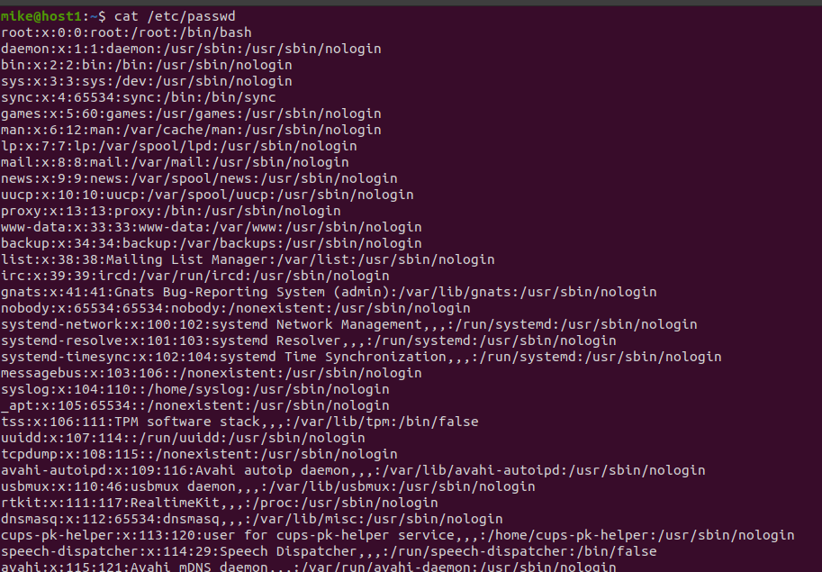

Type of users

- root - admin account - have all rights 
- regular no comment - have only rights that given  from administrator
- service - system user

Several pseudo-user 

Define them

-root, mike, daemon

- find mike user in passwd - grep userName /etc/passwd
- list of users - cat /etc/passwd
- id userName

---------------------Fields in group--------------------

- cat /etc/group - to check groups
- getent group user - info about all users or about particular user

- group name
- password (usually not used)
- GID
- group list (list of users who are members of the group)

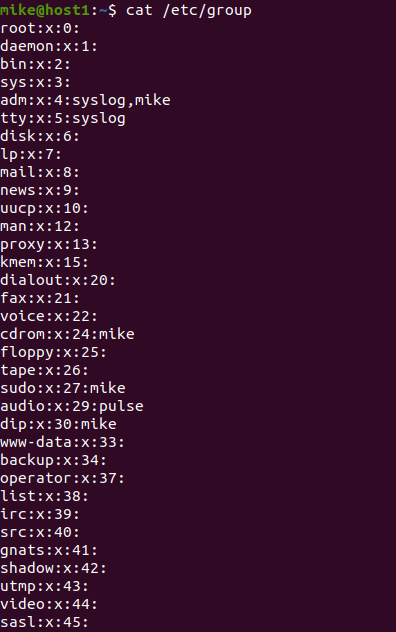

2 ----------------UID ranges/what UID/how define-------------------------

A UID (user identifier) is a number assigned by Linux to each user on the system. This number is used to identify the user to the system and to determine which system resources the user can access.

UID ranges - is number ranges reserved by system for special needs or predefined accounts.

How define

- id command userName and the asme for 

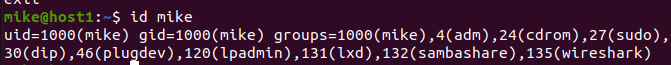

3 ----------------What GID/how define-------------------------
Group identifier is a name and number that associates a user with other users sharing something in common.

How define
- id command userName 

--------------------- 4 -----------------------------

By groups command it show in which grops you are - groups userName

Or just - id command

Who belong to particular group - (need to install utility members then) members nameofthegroup

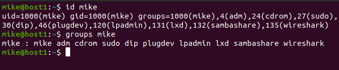

---------------------- 5  ------------------------

useradd - native command (parameters - none)
But second step is add password (passwd userName)

adduser - (perl script which uses useradd binary in back-end)
- password
- full name
- room number
- work phone
- home phone
- others (like comments)

------------------ 6 ----------------------

sudo usermod -l newName oldName - hit Enter))

------------------- 7 --------------------------

It used to initiate home directory when a user is first created.
It could be customize

Here how it looks on my Ubuntu(20.04)

rwxr-xr-x   2 root root  4096 лип 31 19:27 .
drwxr-xr-x 130 root root 12288 січ 23 23:29 ..
-rw-r--r--   1 root root   220 лют 25  2020 .bash_logout
-rw-r--r--   1 root root  3771 лют 25  2020 .bashrc
-rw-r--r--   1 root root   807 лют 25  2020 .profile

------------------------ 8 ------------------------------
 <h2>Remove user from system with mailbox</h2>

- userdel -r <userName>

---------------------- 9 ----------------------

- sudo usermod -L userName - lock user account
- sudo usermod -U userName - unlock user account

---------------------- 10 -----------------------------

sudo passwd -d userName

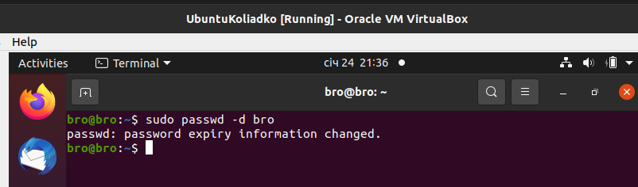

---------------------- 11 -------------------

<code>ls -la</code> 

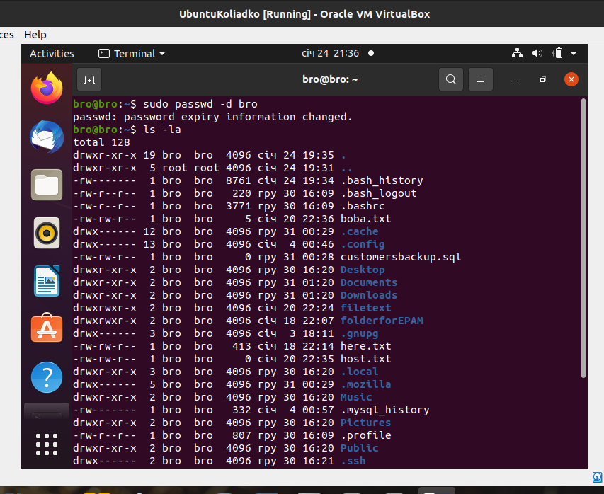

- fields (1-4) with access rights 
- 5 field specifies the number of links or directories inside this director
- 6 field owner of file
- 7 field groups that file belongs
- 8 field size in bytes
- 9 field date of last modification
- 10 field name of the file

----------------------- 12 - 13 -----------------------
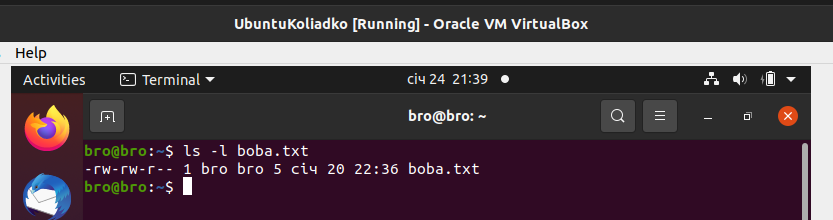
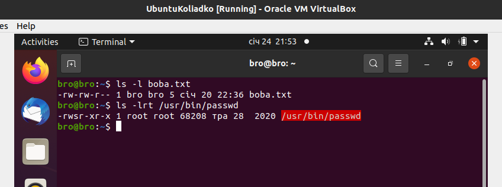

Type of permissions
- r - you can read file
- w - you can write in file
- x - you can execute file

Special access right 
- SUID (file with SUID always executes as the user who owns the file, regardless of the user passing the command)
- SGID (similar to SUID but for groups and if set on a directory, any files created in the directory will have their group ownership set to that of the directory owner)
- Sticky-bit (It restricts file deletion. Only the owner (and root) of a file can remove the file within that directory/protection from fools)

For whom (3 types of ownership)

- User (Owner of file)
- Group (Can contain multiple users. All users belonging to a group will have the same Linux group permissions access to the file )
- Other (Any other user who has access to a file)

------------------------- 14 ----------------------------

chmod 

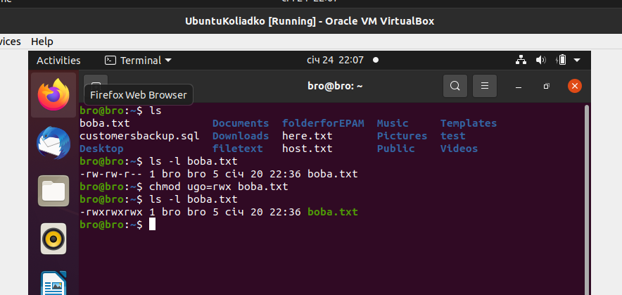

chown

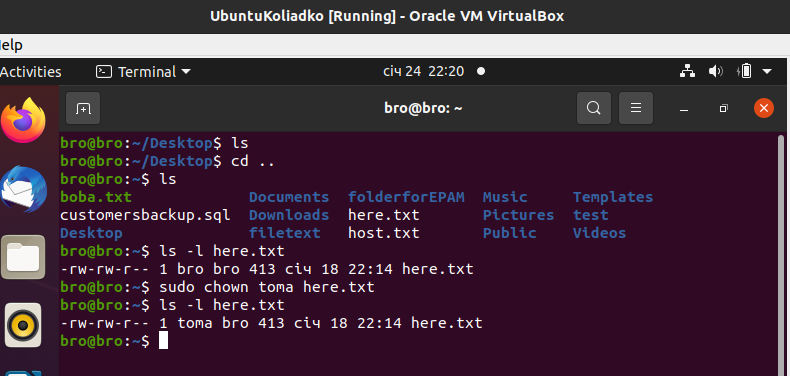

---------------------------- 15 --------------------------------

Octal representation

Example 777 (give all rights)

- r - read - 4
- w - write - 2
- x - execute -1

umask - set default creation permissions
so if you create directory that should be 777 by default with umask you can change this behavior

-------------------------- 16 ------------------------------

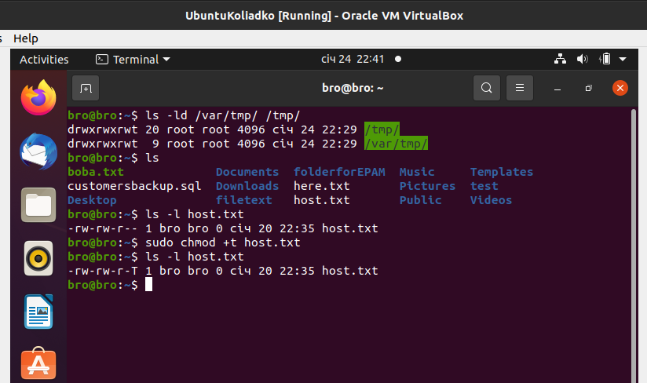

- Sticky-bit (It restricts file deletion. Only the owner (and root) of a file can remove the file within that directory/protection from fools)

-------------------------- 17 -------------------------

- x - execute (script should be executable)

chmod ugo+x name of script_file

