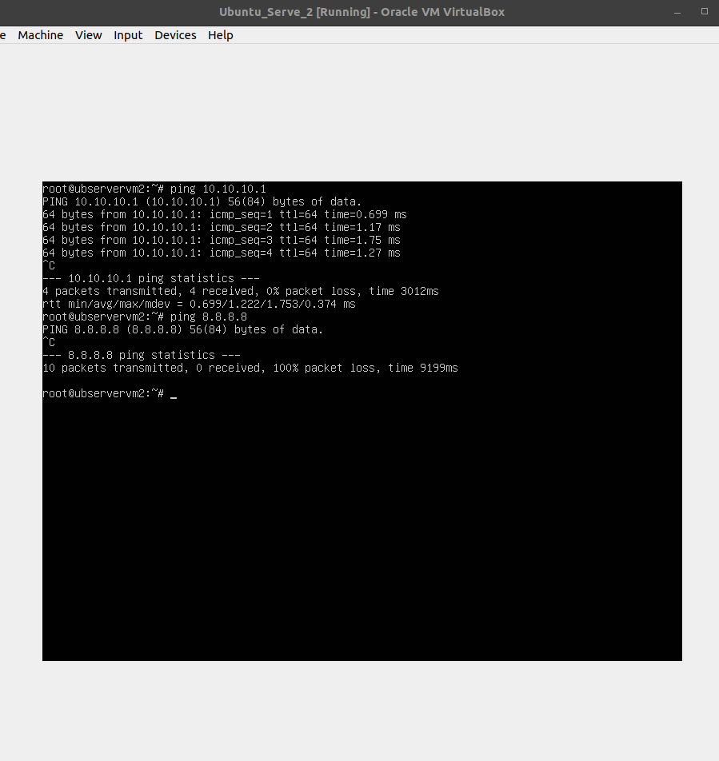
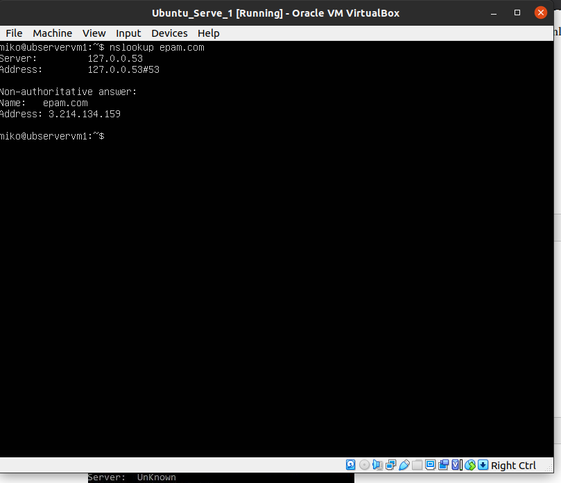

<h2>Options VM1</h2>
<h3>two interfaces NAT, internal and Port Forwarding</h3>

<h2>Options VM2</h2>

<h2>VM1,VM2 netplan settings and apply it</h2>

<h2>VM1 etc/sysctl (port forward)</h2>

<h2>after that, i managed iptables + masquerade</h2>

<h2>check IP status VM1, VM2</h2>

<h2>VM1 PINGs host,selfNat,VM2,DNS 8888</h2>

<h2>VM2 PING internal interfaces VM2</h2>
<h2>After all those manipulation i got no clue, why VM2 can't connect to internet, but can connect to VM1</h2>

<h2>ROUTE VM2</h2>

<h2>Determine, which resource has an IP address 8.8.8.8. and determine, which IP address belongs to resource epam.com.</h2>

<h2>Determine the default gateway for your HOST and display routing table.</h2>

<h2>Trace the route to google.com.</h2>

