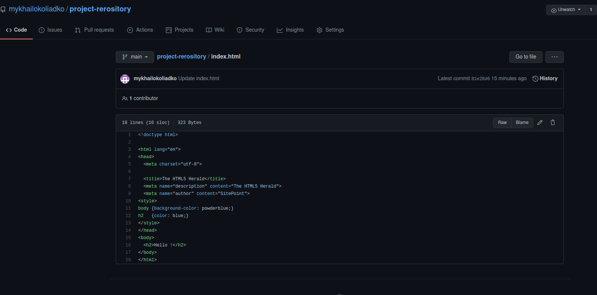
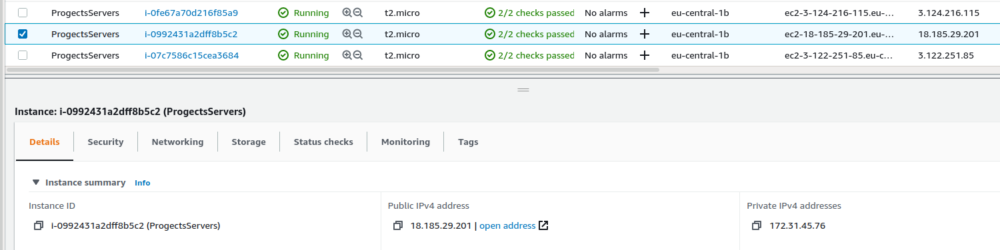
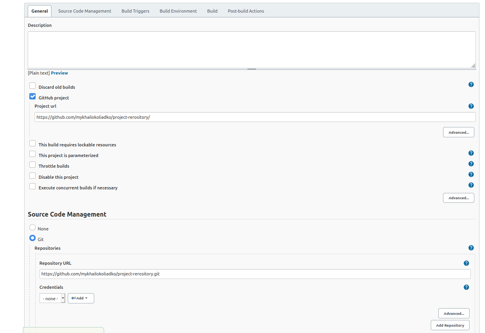
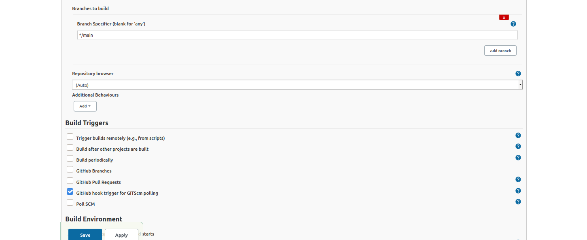
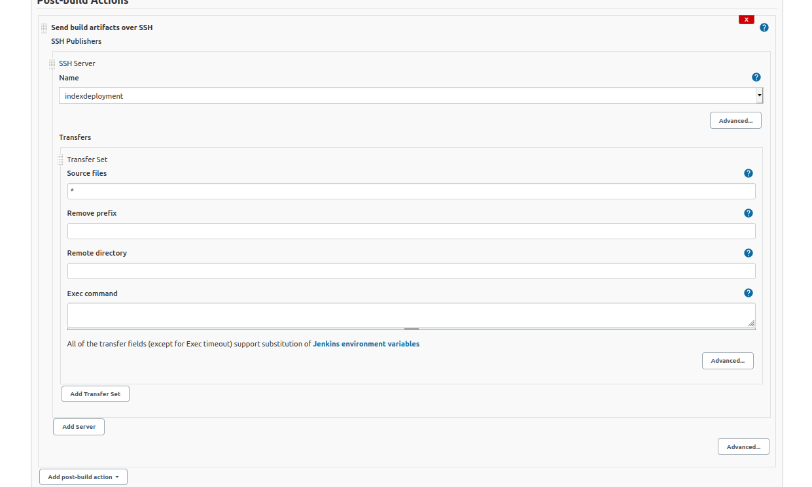
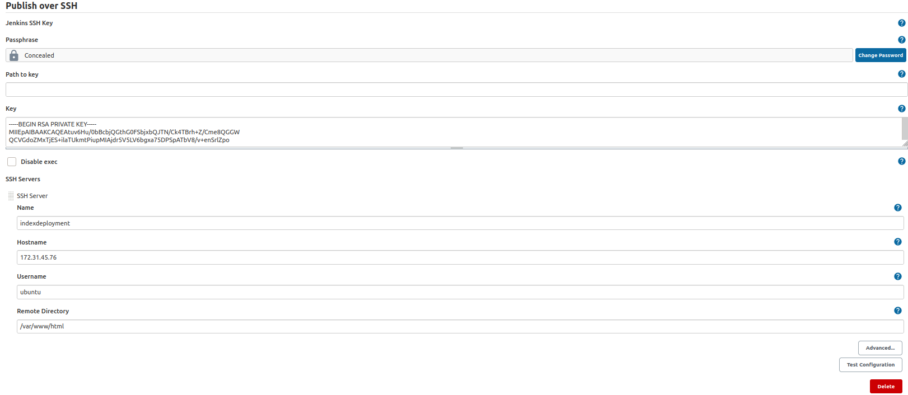
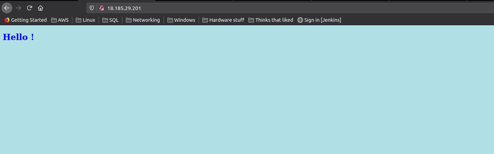
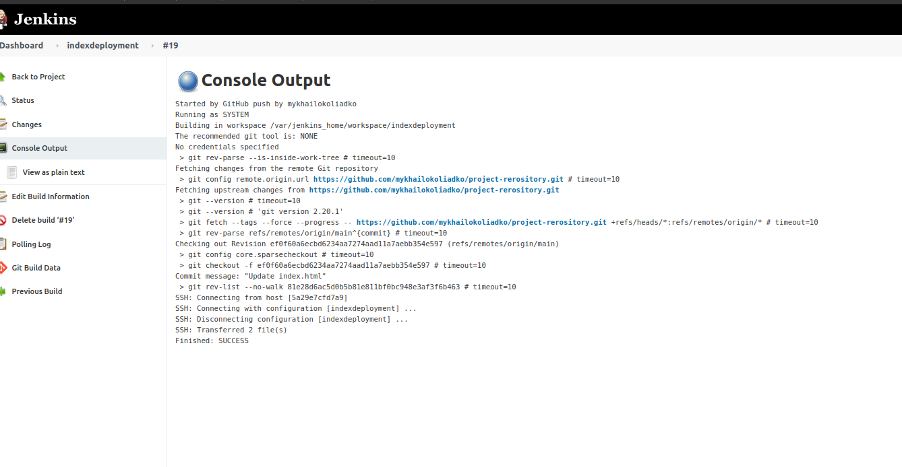
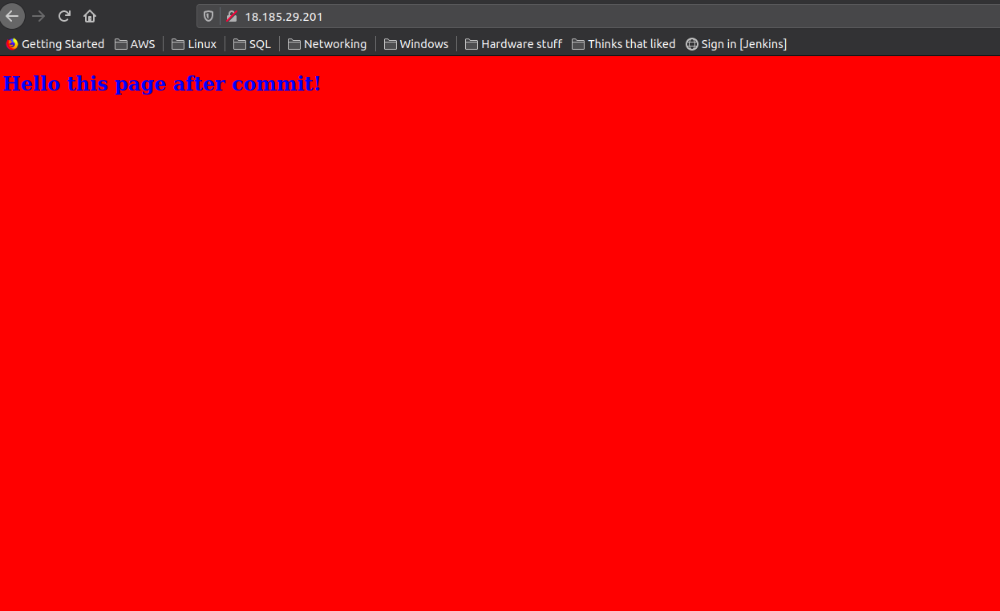

I created simple index.html file on Github
And create EC2 instance on AWS
Next configure Jenkins
 - if some one commit on Github, Jenkins will build and push my index.html file to server (with all changes)

<h2>Create index.html</h2>
 
<h2>Create EC2 (look at IP)</h2>
 
<h2>Configure Jenkins</h2>
 
 
 
 
<h2>Page on server before</h2>
 
<h2>Commit and start jenkins job</h2>
 
<h2>Page on server after</h2>
 

